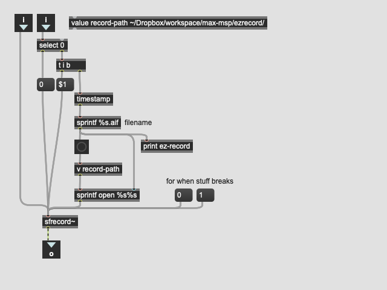
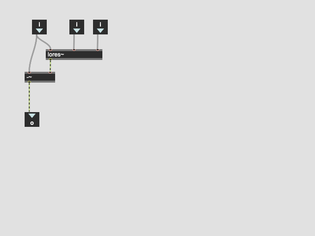
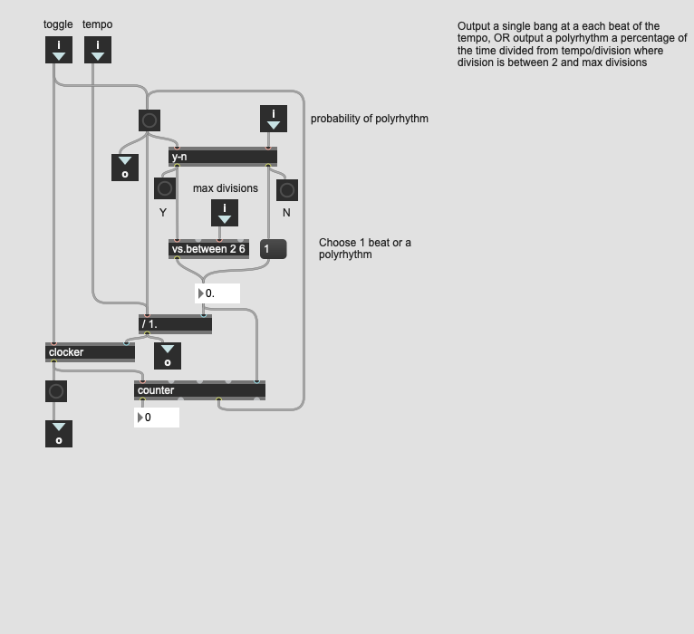
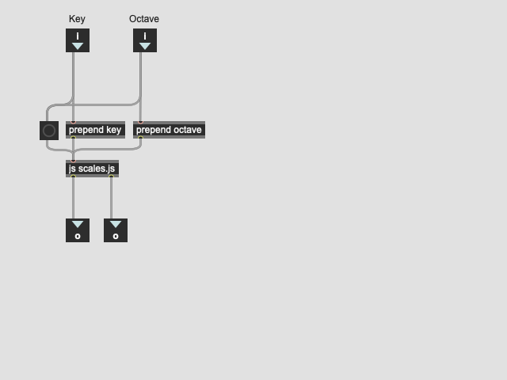
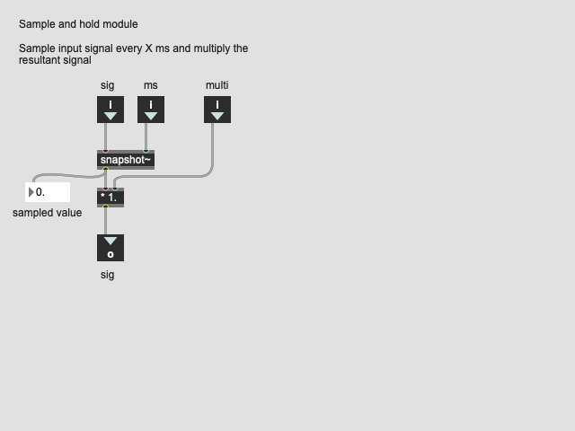
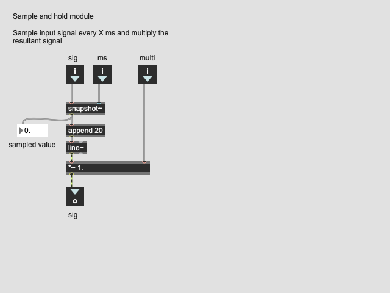
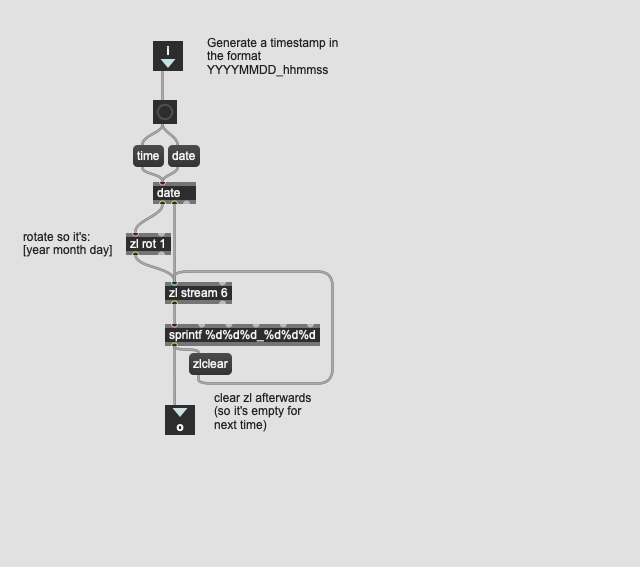
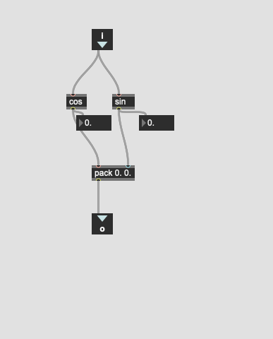

# max-msp patches

I'm learning max and wanted to keep track of the more utility oriented patches so here they are. Open to any suggestions for improvement :)

A couple of these use the virtual sound macros library by the authors of "Electronic Music and Sound Design". The library can be found [here](https://virtual-sound.com/electronic-music-and-sound-design-volume-1-support/)

## ez-record.maxpat: 
Record a signal to a file with a unique name

* __Inputs__: Left Inlet-Signal. Right Inlet-"0" or "1" Message
* __Outputs__: Float
* __Desc__: Records to ~/Drop

## hi-res.maxpat:
hipass filter (1 - lores~)

## prb-pmetro.maxpat: 
probability polyrhythm

* __Desc__: Further divide metronome beats up to the given maximum and output a polyrhythm a certain percentage of the time

## scales.maxpat:

Map scale name and octave to MIDI numbers

* __Inputs__: Left Inlet-(String) Key. Right Inlet-(Number) Octave
* __Outputs__: Left Outlet-(List) MIDI Note Numbers.  Right Outlet-(List) Note names
* __Desc__: Given a key (C, Db, D, Eb, E, F, Gb, G, Ab, A, Bb, B) and an octave output a list containing MIDI note numbers

## snh.maxpat:
Sample and hold module

* __Inputs__: signal, sample period, depth
* __Outputs__: Signal

## timestamp.maxpat: 
Output a timestamp message in format YYYYMMDD_hhmmss

* __Inputs__: Bang
* __Outputs__: Message

## y-n.maxpat: 
make a yes/no decision with probability

## unit-circle.maxpat: 
Given an angle in radians output list with cos and sin values

* __Inputs__: Float
* __Outputs__: List

